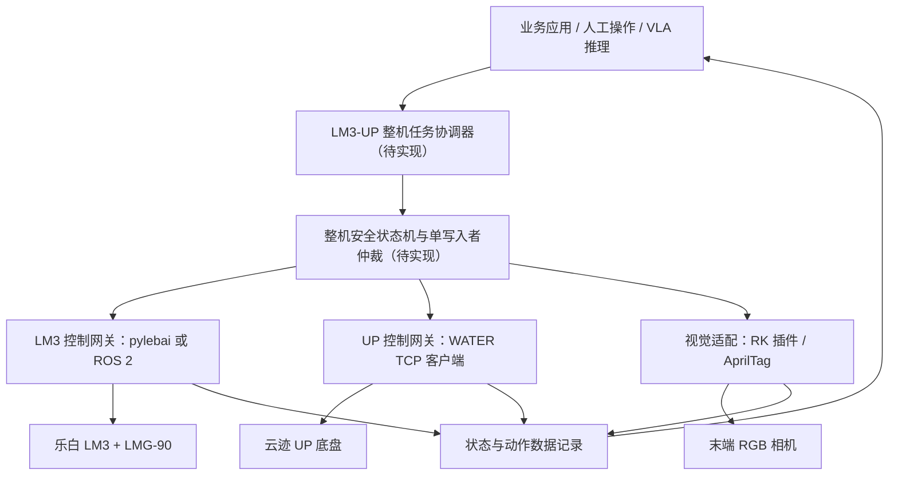

# LM3-UP 开发指南

## 1. 整机定义

本项目中的 LM3-UP 是一台单臂移动复合机器人：

- 乐白 LM3 六轴协作机械臂，额定负载 3 kg，工作半径 638 mm。
- 乐白 LMG-90 两指夹爪，行程 0-90 mm，夹持力 10-35 N。
- RK3588S2 应用/视觉主机和 UVC RGB 相机。
- 云迹 UP 移动底盘，负责定位、建图、导航、回充和移动安全传感。
- 复合机器人控制箱、路由器和收纳柜。

它不是一套由单个 SDK 完整控制的机器人。机械臂、底盘和视觉分别使用不同接口，必须由上层协调器统一管理任务状态和安全互锁。

现有资料只能确认产品族和上述组成，不能确认用户现场 UP 的具体硬件修订、整机序列号、当前固件、地图、标定和网络配置。三个交付 LBD 只记录了 LM3 机械臂型号及导出时软件版本，不能用来反推底盘版本。

## 2. 组件与开发入口

| 子系统 | 职责 | 首选接口 | 本仓库入口 |
| --- | --- | --- | --- |
| LM3 机械臂 | 关节/TCP 运动、IO、夹爪、场景 | 乐白统一 SDK；需要 ROS 时使用对应发行版分支 | `vendor/lebai/sdk/lebai-sdk`、`vendor/lebai/ros/lebai-ros-sdk` |
| UP 底盘 | SLAM、导航、点位、回充、状态 | WATER TCP API v1.8.9；9001 页面用于部署和诊断 | `LM3-UP复合机器人开发资料/water_api手册.pdf` |
| RK 视觉 | UVC 相机、内参、手眼、AprilTag | RK 插件页和乐白 LBD 场景 | `vendor/lebai/integrations/plugin`、交付 LBD |
| 数据/VLA | 图像、机械臂状态、夹爪状态、动作数据 | 先建立经过修复和安全封装的 LeRobot 适配层 | `vendor/lebai/lerobot/lerobot_lebai` 仅作上游参考 |
| 云端业务 API | 订单、任务、商品等旧服务生平台接口 | 与本地 UP/WATER 控制无关 | `vendor/yunji/cloud/open-api`，仅历史资料 |

## 3. 推荐的软件分层

仓库已提供默认仿真的 LM3 机械臂手机遥操安全桥，但尚未实现图中覆盖 LM3、UP、地图/定位和视觉状态的“整机任务协调器”与“整机安全状态机”。机械臂侧桥接器不能替代整机互锁。

## 4. 默认网络拓扑

以下地址来自交付手册，只用于首次发现，不能当作现场当前配置：

| 对象 | 文档默认入口 | 用途 |
| --- | --- | --- |
| 复合机器人路由器 | `192.168.10.240` | 整机局域网和可选上网网关 |
| LM3 | `http://192.168.10.200` | 机械臂 Web 页面；SDK 连接同一控制器 |
| UP | `http://192.168.10.10:9001` | 监控、地图、点位和部署 |
| WATER | `192.168.10.10:31001` | TCP socket API，不是 HTTP REST |
| RK 插件页 | `http://192.168.10.201/ui/plugin` | 相机、标定和 AprilTag 插件 |

资料中还出现过 `192.168.22.200`、`192.168.4.40` 和 `192.168.4.46`。这些是不同阶段或通信方式的示例，不能直接复制。首次联调应从路由器租约、设备标签、9001 状态栏和实际 Web 页面发现地址。

新整理文档不再重复默认口令。需要恢复出厂连接时查看设备标签或原始手册；投产前必须改密，并把控制网络与办公网/互联网隔离。

## 5. 控制权和安全互锁

### 5.1 单写入者

- LM3 同一时刻只有一个运动命令写入者。
- UP 的导航 `/api/move` 与遥控 `/api/joy_control` 由同一个底盘网关仲裁。
- VLA、人工遥控、脚本和任务调度器不能各自直接连接设备并并发写入。
- 初期联调默认禁止“底盘移动时机械臂同时运动”；只有完成整机稳定性、重心、碰撞和急停测试后才能放开组合动作。

### 5.2 急停和失败关闭

- 物理急停是最终安全边界；WATER `/api/estop` 只是软件急停，不能解除硬急停。
- 软件或整机重启可能重置软急停状态，不能把软急停当作持久安全锁。
- 任一设备断连、状态超时、错误码非零、地图不匹配或定位异常时，协调器应拒绝新动作并进入人工确认。
- API 返回 `OK` 只表示请求被接受。机械臂要等待运动完成，底盘要等待 `move_status/running_status` 和现场运动都结束。

## 6. 首次接入顺序

### 阶段 A：只读资产盘点

1. 记录整机序列号、实际 IP、控制器/软件版本、当前地图和楼层。
2. 通过 LM3 Web 页面只读检查机器人状态和急停原因。
3. 通过 9001 页面检查电量、充电、软硬急停、定位和错误状态。
4. 记录 RK 插件版本、相机索引和已有标定，不修改参数。
5. 保存截图和时间戳，不执行运动。

### 阶段 B：分别验证设备

1. LM3：先读取状态，再在现场监护下做最低速度、无负载、单条轨迹测试。
2. UP：先在现有地图内做短距离导航、取消任务、障碍停止和自动回充。
3. 视觉：先验证相机和标签识别，再做内参、手眼和重复定位验收。
4. 每个子系统失败都必须能独立停止，不能依赖上层模型补救。

### 阶段 C：整机协调

1. 底盘到达目标并稳定为 `idle`。
2. 重新读取定位、急停和错误状态。
3. 锁定底盘运动写入权，再允许机械臂进入工作区。
4. 机械臂完成并回到运输/安全姿态后，才释放底盘导航。
5. 对断网、急停、目标被占、抓取失败和人工接管分别做负向测试。

## 7. 地图、视觉和抓取边界

- 同名同楼层创建地图会覆盖旧地图；禁行线重名会删除原线，操作前必须备份。
- 楼梯、玻璃、悬空边缘和镂空桌椅必须通过实体防护与禁行线共同隔离。
- RK 指南要求的相机内参和手眼标定通常各采集 15-30 个姿态；“生成参数”不等于精度合格。
- `apriltag` 插件和 LBD 必须统一选择 signal 或 Modbus 通信方式。
- 交付 `cell2tag`、offset、标签 ID 和 IP 都是示例。相机、夹爪、TCP 或标签安装变化后必须重标。
- 交付抓取场景没有完整碰撞、夹取成功、超时和失败退避，必须先低速空载重构和验收。

## 8. 推荐实施路线

| 里程碑 | 目标 | 完成门槛 |
| --- | --- | --- |
| M0 | 资料和 SDK 基线 | 本仓库可复现初始化；所有风险有明确标注 |
| M1 | 只读状态网关 | 同时读取 LM3、UP 和视觉状态，不发送动作 |
| M2 | 独立低速控制 | 机械臂与底盘分别通过安全门槛和负向测试 |
| M3 | 整机任务协调 | 单写入者、互锁、超时、急停和人工接管可验证 |
| M4 | LeRobot 数据采集 | 时间同步、相机标定、动作频率和数据质量稳定 |
| M5 | VLA 沙箱推理 | 只记录建议动作，不下发真机 |
| M6 | 受限真机 VLA | 动作限幅、工作空间、碰撞、看门狗和急停全部在模型外执行 |
