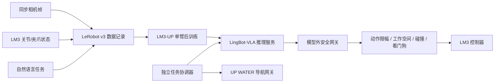

# LingBot-VLA 接入 LM3-UP 评估

## 结论

**可以作为二次研发候选，但不能直接给 LM3-UP 使用。**

LingBot-VLA 提供基础权重、后训练框架、机器人特征映射和 WebSocket 推理服务，不提供 LM3、UP 底盘、WATER、ROS/MoveIt、安全控制器或完整的硬件适配。公开模型动作不能直接发送给机械臂或底盘。

本评估依据 LingBot-VLA `main` 提交 `4eb34b7693a0565c67433f8fac9c59a2e67eb60b`（2026-06-12）及本仓库固定的乐白适配器版本。

## 1. 主要不匹配

| 项目 | LingBot-VLA 公开方案 | LM3-UP 当前资料 | 结论 |
| --- | --- | --- | --- |
| 机器人形态 | 主要是固定底盘的双臂桌面操作 | 单个 6 轴 LM3 + 夹爪 + 移动 UP 底盘 | 必须重新定义单臂动作空间；底盘单独控制 |
| 图像 | 默认顶部/头部、左腕、右腕三路 RGB | 交付资料明确一台末端 UVC RGB 相机 | 需要增加相机或用本机数据重训新的观测映射 |
| 状态/动作 | 连续动作块，示例双臂 12 关节 + 2 夹爪 | LM3 为 6 关节 + 1 夹爪 | 不能复用公开 RoboTwin 动作配置 |
| 底盘 | 真实机器人评测中底盘和腰部固定 | UP 负责 SLAM、导航和回充 | VLA 不应直接输出 WATER 命令或底盘速度 |
| 硬件适配 | 仓库只有具体的 RoboTwin 映射示例 | 已有首版 LM3-UP 特征映射、原始数据链路和默认仿真的机械臂安全桥 | 仍缺经真机验收的 LeRobot robot adapter、训练/推理执行链和整机互锁 |

## 2. 当前 LeRobot 适配器状态

乐白官方仓库 `vendor/lebai/lerobot/lerobot_lebai` 说明了可行的数据结构方向，但当前固定版本不能直接作为 LingBot-VLA 桥接：

- `lerobot_lebai/lebai.py:76` 是确定的 Python 语法错误，AST 解析失败。
- 动作只覆盖 6 个关节和夹爪，没有 UP 底盘状态/动作。
- `connect()` 自动调用 `start_sys()`，`disconnect()` 自动调用 `stop_sys()`，不适合作为默认只读采集器。
- 没有实际校准流程、关节/速度/工作空间限制、等待完成、碰撞检查和看门狗。
- 关节动作命中后提前 `return`，同一动作字典里的夹爪动作不会继续执行。

当前 `teleop/` 已实现独立的原始 episode 记录、LeRobot v3 导出计划、LingBot 特征模板和机械臂侧安全桥；它没有复用上述有缺陷的适配器。下一步仍需建立经真机验收的 `lm3_up_lerobot` 机器人适配/执行层，完成官方 LeRobot+FFmpeg 回读、离线回放、影子模式和分级真机验收后再让 VLA 输出进入安全桥。

## 3. 推荐架构

第一版应保持 UP 使用现有地图和 WATER 状态机，让 VLA 只在底盘停止、定位稳定、工作区锁定后处理局部单臂操作。更保守的起点是让 VLA 只输出高层步骤，由确定性技能执行。

## 4. 必须补齐的数据与接口

### 观测

- 至少一条稳定、时间戳可对齐的 RGB 图像流；若采用 LingBot 默认结构，应新增顶部/环境相机并明确腕部相机映射。
- 6 个 LM3 实际关节位置、速度和可选力矩。
- LMG-90 实际开度/稳定状态。
- 任务文本、机器人模式、急停和错误状态。
- 每个 episode 的相机内参、外参、TCP、夹爪和场景版本。

### 动作

- 第一阶段优先使用 6 关节增量 + 夹爪绝对开度，或经验证的 TCP 增量。
- 明确动作频率、时间单位、角度单位、归一化统计和 episode FPS。
- 模型动作进入机器人前执行关节限位、速度/加速度限制、工作空间限制、奇异位形与碰撞检查。
- UP 的导航点、线速度/角速度和 WATER 命令不进入同一个低层 VLA 动作向量。

## 5. 分阶段门槛

1. **离线适配**：修复/重写 LeRobot 适配器，AST、单元测试和模拟 observation/action 通过。
2. **只记录**：连接真机只采集状态和图像，不调用 `start_sys()` 或动作 API。
3. **示范数据**：在人工示教和现场监护下采集足量单臂任务，检查时间同步和数据分布。
4. **离线推理**：模型对录制数据输出动作，只做可视化和数值审查。
5. **影子模式**：在线接收观测但不下发动作，对比人工动作和安全限制命中率。
6. **受限真机**：固定底盘、空载、最低速度、小工作空间、逐步动作，并保留物理急停。
7. **任务协调**：只有局部操作稳定后，才由确定性状态机串联“导航到点 -> 锁底盘 -> 操作 -> 收臂 -> 释放底盘”。

## 6. 运行环境和授权注意

- LingBot-VLA 当前官方安装栈为 Linux、Python 3.12.3、PyTorch 2.8.0、CUDA 12.8、LeRobot 0.4.2 和 FlashAttention 2.8.3。
- 推理实现依赖 CUDA，官方未公布最低显存；24 GB 也需要实测，48 GB 更适合保守验证。
- 基础权重定位是后训练起点，不是 LM3-UP 即插即用检查点。
- 代码仓库为 Apache-2.0；模型卡虽声称相同许可证，模型仓库当前缺独立 LICENSE/metadata，产品使用前仍应确认权重、基础模型和数据授权。

参考：

- [LingBot-VLA 仓库](https://github.com/Robbyant/lingbot-vla)
- [自定义 LeRobot 数据说明](https://github.com/Robbyant/lingbot-vla/blob/4eb34b7693a0565c67433f8fac9c59a2e67eb60b/lingbotvla/data/vla_data/README.md)
- [部署策略实现](https://github.com/Robbyant/lingbot-vla/blob/4eb34b7693a0565c67433f8fac9c59a2e67eb60b/deploy/lingbot_vla_policy.py)
