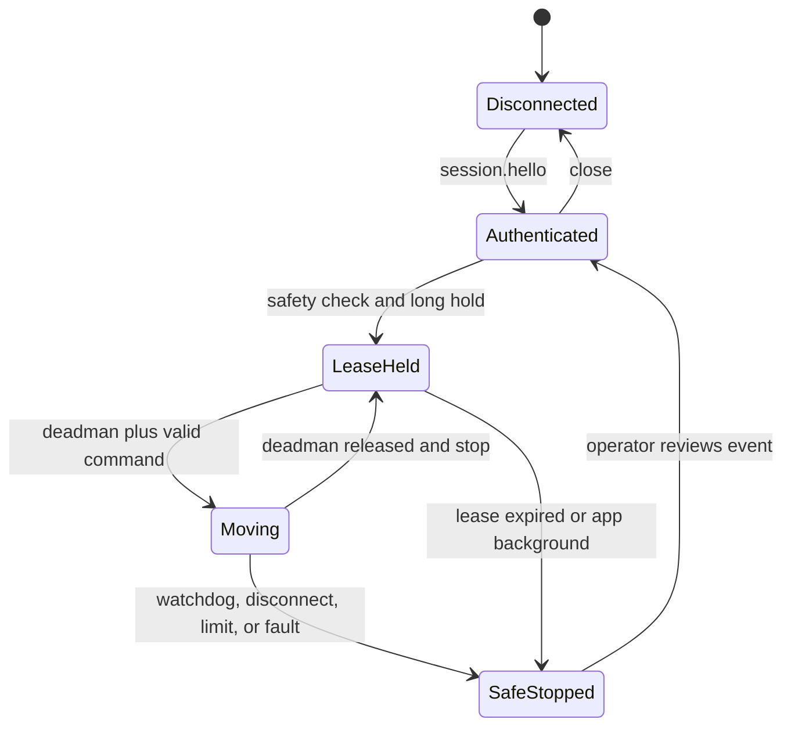

# LM3-UP 手机遥操与 VLA 数据采集

## 1. 结论

可以为 LM3-UP 做基于手机姿态传感器的遥操，并用示范数据后训练 LingBot-VLA，但不能把公开的手机遥操项目或 LingBot 权重直接连接到真机。

这里的“手机陀螺仪遥操”会先在 Android/HarmonyOS 上确认设备存在硬件陀螺仪；缺失时姿态模式直接禁用。通过门禁后采用系统融合的 **Rotation Vector**，而不是直接积分原始角速度。Rotation Vector 以陀螺仪为主要动态来源，并结合其他 IMU 数据抑制漂移。它能可靠表达手机的 3DoF 旋转，不能可靠测量手机在空间中的 X/Y/Z 平移，因此本实现把手机旋转映射到 LM3 TCP 的 `Rx/Ry/Rz`，把原有触屏轴键保留为 `X/Y/Z` 平移输入，不伪造手机 6DoF 位置。

首版采用：

```text
Android / HarmonyOS 原生 App
  Rotation Vector → TCP Rx/Ry/Rz
  触屏轴键      → TCP X/Y/Z
        ↓ lm3-teleop.v1 WebSocket
Python 安全桥（默认模拟器）
        ↓ 显式真机模式
已构建且匹配 Python 的 pylebai → LM3 六轴机械臂 + LMG-90 夹爪

相机 → 同步原始 episode → 离线导出 LeRobot v3
                                  ↓
                           LingBot-VLA 后训练
                                  ↓
                       影子模式 → 安全桥 → LM3
```

UP 底盘不进入首版遥操/VLA 动作空间。正确顺序是“确定性导航到点 → 确认底盘 idle 并锁定 → 机械臂任务 → 收臂 → 释放底盘”。



## 2. Seeed 项目到底做了什么

用户提供的 `Seeed-Studio/wiki-documents` 是文档站点。它明确展示了键盘/鼠标、Leader 主臂、手动拖动和 VR 遥操，但没有提供通过手机陀螺仪控制机械臂的源码。

关联的 Phosphobot 可以作为 VR 架构参考：其 `/move/teleop/ws` 接收的位置与欧拉角模型在源码中明确写成 Meta Quest 数据，控制页也列出 Meta Quest 2/Pro/3/3S。机器人侧再完成坐标转换、逆解和硬件执行。它不能作为“已有手机陀螺仪实现”的证据，先前把它描述成手机网页持续发送 X/Y/Z/Rx/Ry/Rz 的说法不准确。

它不能原样用于 LM3-UP，原因包括：

- 上游面向其他机械臂和开发环境，没有 LM3-UP 的工作空间、夹爪和底盘互锁；
- 默认网络暴露和跨域设置不满足机器人控制网要求；
- 没有本机手册要求下的单写入者、长按解锁、失联看门狗和真机显式启用门槛；
- 上游 VR WebSocket 并不具备本仓库要求的单租约、严格时序、传感器新鲜度和失败关闭语义。

LeRobot v0.4.2 的 `examples/phone_to_so100` 是更接近的参考：Android 使用 WebXR，iOS 使用 ARKit/HEBI Mobile I/O，形成“手机 6DoF AR 位姿 → 末端目标 → 边界/安全 → IK → 关节动作”的管线。它依赖平台空间跟踪，不等同于纯陀螺仪，也没有 LM3、HarmonyOS、UP 底盘互锁或本仓库的安全协议。

本仓库因此采用跨 Android/HarmonyOS 都可获得的原生 Rotation Vector，只执行相邻样本的旋转增量。标准握持约定为屏幕朝上、手机顶部指向机器人基坐标 `+X`，固定映射为 `[phone_x, phone_y, phone_z] → [tcp_ry 负向, tcp_rx 正向, tcp_rz 正向]`，即 `[tcp_rx,tcp_ry,tcp_rz]=[phone_y,-phone_x,phone_z]`；首次使用仍必须在模拟器逐轴验向。每次进入模式都生成新的 `calibration_id` 并显式归零；首帧只建立基线不运动。手机端最多 20 Hz 发送，服务端再次检查租约、DEADMAN、时间递增、采样间隔、置信度、有限数值、单帧跳变和角速度，再转换为受限 TCP 角速度。

## 3. 三端职责

| 组件 | 负责 | 不负责 |
| --- | --- | --- |
| Android App | 原生 Rotation Vector、归零校准、按住式陀螺仪 DEADMAN、触屏 XYZ、夹爪、录制与状态显示 | 从陀螺仪推断 XYZ、IK、最终限幅、底盘控制 |
| HarmonyOS App | 使用 `SensorId.ROTATION_VECTOR` 实现相同的 3DoF 旋转协议和生命周期停机 | 声称拥有未实现的 AR 6DoF 空间跟踪能力 |
| Python 安全桥 | 会话握手、最长 2000 ms 单写入者租约、仅 IDLE 授权、严格单槽 20 Hz 限流、300 ms watchdog、连续运动反馈冻结检测、工作空间、pylebai、记录 | 应用层身份认证、解除急停、自动上使能、底盘导航或持续读取 UP 硬件互锁 |
| 外部 GPU 主机 | LingBot 数据处理、后训练、推理/影子模式 | 绕过安全桥直接写机器人 |
| UP 确定性控制器 | 导航、状态确认、底盘锁定与释放 | 接收 VLA 低层轮速 |

完整消息格式见 [`../teleop/PROTOCOL.md`](../teleop/PROTOCOL.md)。

## 4. 必须失败关闭的条件

以下任一条件出现，桥接器都应停止机械臂、撤销租约并发出 `safety.event`：

- 300 ms 内没有新的有效 deadman 运动命令；
- App 进入后台、WebSocket 断开或控制租约过期；
- 序号重复/倒退、消息过期、速率超限或字段不是有限数值；
- 姿态样本未跟踪、置信度不足、传感器时间倒退/间隔异常、样本陈旧或旋转跳变；
- 机器人状态不允许运动、急停存在、底盘未被确认锁定；
- TCP 当前或预测位置超出现场配置的工作空间；
- 后端异常、反馈停滞或命令执行结果无法确认。

控制租约只允许在乐白官方状态码 `5 (IDLE)` 时取得，状态码 `7 (MOVING)` 不能取得新租约。租约配置和请求范围为 500–2000 ms；20 Hz 限流器只有一个令牌槽，不能用积攒令牌在同一时刻连续下发两条动作。

硬件后端通过独立于普通 `pylebai` 后端锁的连接，默认向控制器 `3031` 端口发送 `stop_move` JSON-RPC，并给停止请求设置 200 ms 软件 deadline。这个设计可避免已阻塞的普通 SDK 调用直接排住 watchdog stop，但 Windows/Python/网络/控制器不是硬实时链路，也不能保证机械臂在 200 ms 内物理停止。普通 `pylebai` RPC 仍可能延迟；有限 `speedl` 持续时间、独立软件 stop、现场监护和可触达的物理急停缺一不可。

当前 `base_locked` 是真机启动前的静态现场声明，不是桥接器持续读取到的 UP 底盘硬件互锁；“底盘未锁定失败关闭”只对该配置声明和 LM3 侧状态成立。接入整机前必须由独立确定性协调器持续确认 UP 停止/锁定。反馈冻结检测比较连续非零笛卡尔命令期间的关节与 TCP 变化，它是软件启发式保护，阈值、噪声容限和真实停止效果仍需 LM3-UP 真机验证。

夹爪的 DEADMAN 目前只授权发送一次目标；`motion.stop/stop_move` 不能据此视为会中途停止 LMG-90。真机示范采集前必须验证夹爪的停止/保持语义、夹持力、夹伤间隙和人工解困，并把“命令已接受”和“实际到位”分开记录。

真机 SDK 必须使用与目标 Python 匹配、已构建完成的 wheel，或让 `pylebai_path` 指向同时包含可导入 `pylebai` 和原生扩展 `l_master` 的构建产物。仓库里的 SDK 源码 `python` 目录本身不能直接作为运行时绑定。

## 5. 原始示范数据

桥接器先记录可审计的原始 episode，不在实时控制循环中直接改写为训练格式：

```text
episode-id/
  metadata.json
  frames.jsonl
  images/
    camera_top/
    camera_wrist/
  manifest.sha256
```

episode 的 `metadata.json` 保存任务文本、模式、终端和相机清单；每条 `frames.jsonl` 记录至少包含：

- 服务端单调时间、Unix 时间、episode/frame 序号；
- 6 个实际关节角和关节速度；
- 实际 TCP 位姿和夹爪反馈；
- 手机发来的笛卡尔速度、陀螺仪校准 ID、传感器时间、旋转增量、deadman、控制序号和网络间隔；
- 相机帧路径/采集时间/时间偏差；导出 LeRobot 时再把 episode 任务文本写入每个训练 row；
- watchdog、钳制、租约、机器人状态和异常标志。

`manifest.sha256` 必须非空，使用 64 位十六进制 SHA-256，精确覆盖 `metadata.json`、`frames.jsonl` 和 episode 下的全部图像/文件；绝对路径、目录穿越、重复路径、自引用、未列文件、多列文件或逃逸链接都会使验证失败。

录制 `fps` 必须等于服务端 `state_hz`。导出器以服务端单调时间按该固定 FPS 的整数时间网格对状态做最近邻重采样，并检测采样间隙；相机也按采集时间做受限窗口最近邻匹配，超出窗口时失败而不是伪造同步。未显式指定相机时只使用所有 episode 共有的相机；若共有集合为空则导出失败，禁止静默生成不含视觉特征的 state-only 数据集。导出前还会验证图像可解码、同一路相机尺寸一致，导出后重新加载 LeRobot 数据集并核对帧数、episode、FPS、features 和有限的 `meta/stats.json`。

## 6. LeRobot v3 与 LingBot 映射

首版训练特征：

```text
observation.state = [q1, q2, q3, q4, q5, q6, gripper]
action            = 下一时刻实际 [q1, q2, q3, q4, q5, q6, gripper]
```

可以额外保存 `action.cartesian_velocity` 用于审计或其他策略，但 LingBot 主动作应以实际到达的关节/夹爪状态为目标，避免把被安全层拒绝或钳制的手机命令当成真值。

LingBot 机器人映射模板见双相机版 [`../teleop/configs/lingbot_lm3_up.yaml`](../teleop/configs/lingbot_lm3_up.yaml) 和仅腕部相机版 [`../teleop/configs/lingbot_lm3_up_wrist_only.yaml`](../teleop/configs/lingbot_lm3_up_wrist_only.yaml)：

- 机械臂：6 维，真实数据推荐 `subtract_state: true`；
- 夹爪：1 维绝对开度，`subtract_state: false`；
- 相机：推荐 `camera_top` 与 `camera_wrist`。当前交付明确的是末端 UVC 相机；若没有固定顶部相机，必须选择仅腕部相机 YAML，使训练 feature 与实际导出数据一致；其泛化和遮挡表现需要单独验证。

导出后仍必须：

1. 检查每个 episode 的任务文本、帧数、时间单调性和图像缺失率；
2. 用 LM3-UP 数据计算自己的 normalization statistics；
3. 从 LingBot 基础权重后训练，不使用 RoboTwin 动作维度直接执行；
4. 先离线回放，再运行只记录不执行的影子模式；
5. 最后才在固定底盘、低速、空载和小工作空间内真机验收。

## 7. LingBot 部署边界

LingBot 当前公开推理实现调用 CUDA，机器人自带 RK3588S2 没有直接兼容证据。推荐在外部 NVIDIA/CUDA 主机运行策略服务，通过受控网络把候选动作发给安全桥。

策略服务不能占有 pylebai 连接，也不能直接发布 UP 轮速。安全桥必须始终可以拒绝、钳制和停止模型动作。

## 8. 验证阶梯

1. JSON/schema、租约、限速、watchdog 和记录器单元测试。
2. 模拟后端 + Android/Harmony 客户端端到端测试。
3. 录制数据的校验、哈希清单和 LeRobot v3 离线导出检查。
4. 无动作影子模式，对比策略输出与人工示范。
5. 固定底盘、最小速度、空载、缩小工作空间的真机测试。
6. 单任务少量后训练与人工逐帧复核。
7. 只有前序验收通过后，才扩大任务、速度和工作空间。

本仓库当前自动化验证只覆盖代码、模拟后端和本地临时数据，不连接真机。尚未完成 LM3-UP 真机、Python 3.11，以及官方 LeRobot v0.4.2 + FFmpeg 在 Windows 上的完整导出/回读端到端验证；任何真机或数据流水线验收结论都必须填写 [`真机联调与验收清单.md`](真机联调与验收清单.md) 并附实际环境与日志证据。
